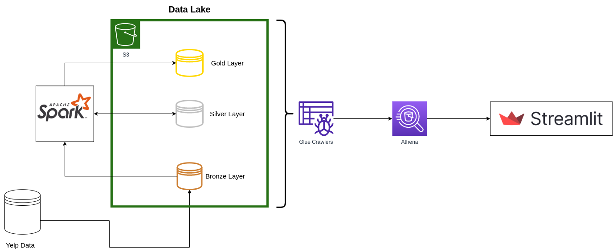
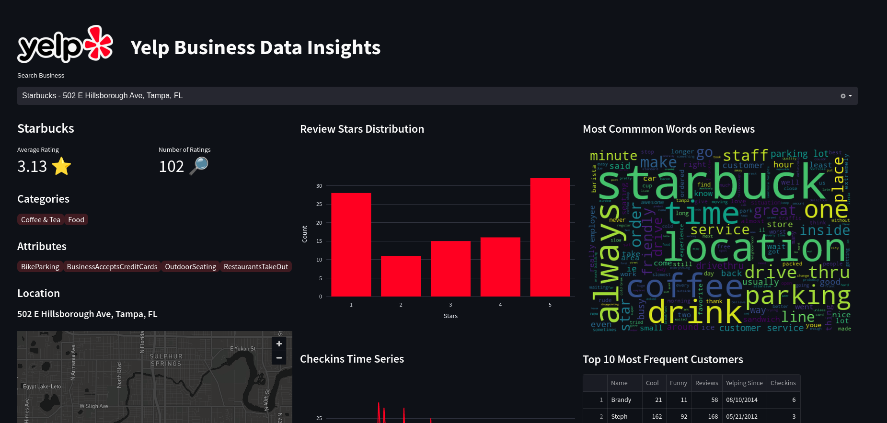

# Yelp Data Lake Project

Yelp is an American Company responsible for maintaining Yelp.com, a famous platform oriented towards crowd sourced reviews of business all over the world, having achieved more than 200 million reviews and more than 5 million business reviewed in 2021.

Having a extensive and rich database, Yelp offers a subset of it's data freely for learning purposes, containing information about real business, users, tips, reviews and checkins on the platform. The idea of this project is to create a Data Lake to store this data and prepare it for a data analysis through a dashboard containing some metrics and charts filtered for each business present on the dataset.

## Project Goals

The main learning goals of this project are:

- Practice the building of a Medallion Structure Data Lake using PySpark.
- Use AWS Athena to support Data Visualizations on a external tool.

## Project Architecture

The Project Architecture is mainly based on a Medallion Architecture Data Lake, containing three layers (Bronze, Silver and Gold) containing the raw data, processed data and analytical grouped views, respectively.  The loading and processing of each of these layers was done using Apache Spark through Pyspark.

The generated data is them submited to AWS Glue Crawlers, which obtain their schema allowing them to be queried and analyzed through AWS Athena, which basically is a data analysis tool that allows to execute SQL queries over unstructured data stored S3 Buckets, such as the ones on this project's data lake.

Using a proper Athena connector in Python, queries can be sent to it directly from code and the results are directly obtained as Pandas Dataframes, which can them be further manipulated to be visualized on a Streamlit application.

## Data Visualization

To visualize the data, an Streamlit application was developed, containing a single main page where some metrics and charts are generated for a selected business through a search bar. The application contains, for each business:

- The Average Rating and Number of Reviews
- List of Categories and Attributes
- Business Location on a Map
- Review Ratings Distribution
- Word Cloud of most common words in all Reviews
- Time Series of Checkins
- List of most frequent Customers

The application can be acessed [here](https://andre-ls-yelp-lake-appyelp-app-fn4kir.streamlit.app/).

## Further Steps

- The Review Data contains the full text of each user review, which could be a potential dataset for NLP applications and Sentiment Analysis.
- The User Data contains data about User Friends, which could be converted to a Graph Dataset that could feed a robust Recomendation System.
- The performance on the Streamlit dashboard, despite not being the main focus of this project, is not good enough for a pleasant user experience, so trying to optmize it on the code somehow or changing the visualization tool to a better one could also be a desired next step for improving the project.
